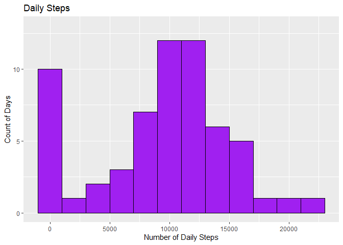
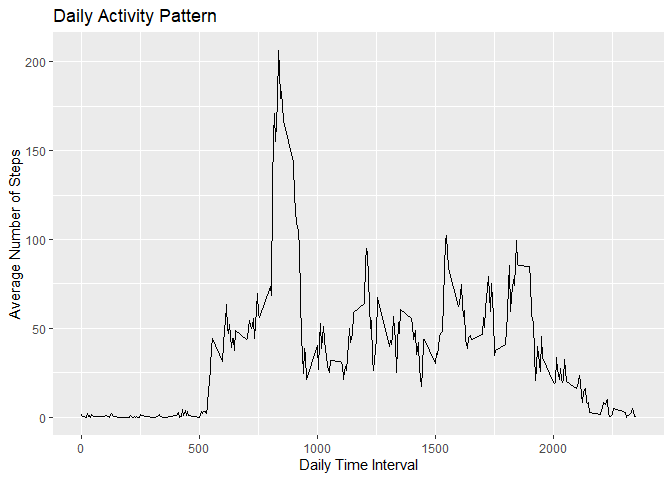
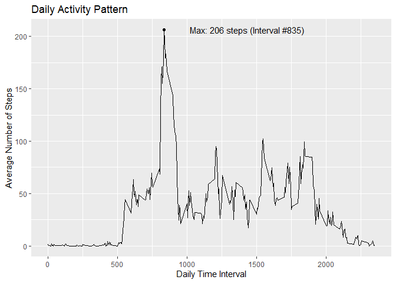
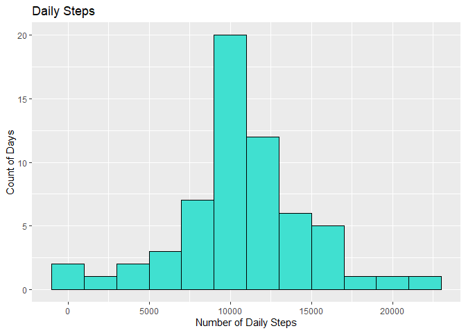
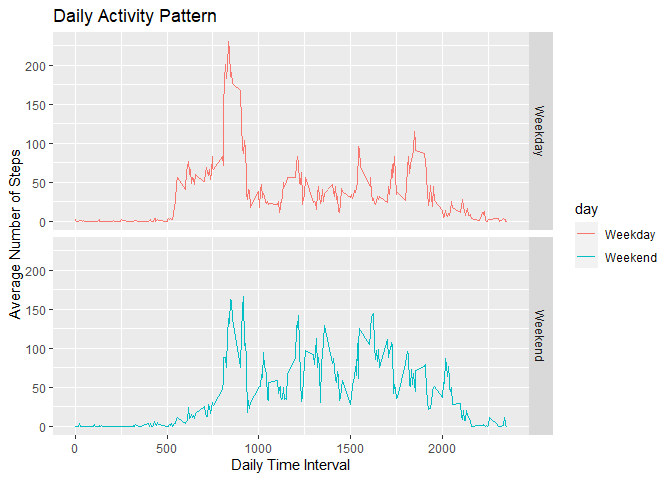

## Loading and preprocessing the data

For this assignment, we will use the 'dplyr' and 'ggplot2' packages in R, which
are assumed to be installed on the current device.


```r
library(dplyr)
library(ggplot2)
```

The working directory/repository already contains the necessary dataset for the
assignment in the file "activity.zip", so it does not need to be downloaded separately.

Read the file:


```r
unzip("activity.zip")
activity <- read.csv("activity.csv")
```

Next, convert dates to POSIXct format.


```r
activity$date <- as.POSIXct(activity$date, format = "%Y-%m-%d")
```

## What is mean total number of steps taken per day?

For this question, missing values will be ignored.  To calculate the total
number of steps per day, sum all values for each date.


```r
total_steps <- activity %>%
     group_by(date) %>%
     summarize(steps = sum(steps, na.rm = TRUE))
```

To double-check, let's take a quick look at total_steps.


```r
head(total_steps)
```

```
## # A tibble: 6 × 2
##   date       steps
##   <chr>      <int>
## 1 2012-10-01     0
## 2 2012-10-02   126
## 3 2012-10-03 11352
## 4 2012-10-04 12116
## 5 2012-10-05 13294
## 6 2012-10-06 15420
```

Here is a histogram of the total number of steps taken each day.


```r
steps_histo <- ggplot(total_steps, aes(steps)) +
     geom_histogram(color = "black", fill = "purple", binwidth = 2000) +
     labs(x = "Number of Daily Steps", y = "Count of Days",
          title = "Daily Steps") +
     scale_y_continuous(limits = c(0,13))

print(steps_histo)
```

<!-- -->

Now we find the mean and median total number of steps taken per day, then print the result (noting that a whole number of steps makes more sense than partial steps):


```r
steps_mean <- with(total_steps, mean(steps))
steps_median <- with(total_steps, median(steps))
cat("The mean total number of steps per day is ", round(steps_mean), ", and the median is ", steps_median, ".", sep = "")
```

```
## The mean total number of steps per day is 9354, and the median is 10395.
```
## What is the average daily activity pattern?

To see what the average daily activity pattern looks like, we can make a time series plot of each 5-minute interval in a day and the number of steps taken, averaged across all days.

First, find the mean steps for each time interval in the data set.


```r
daily_steps <- activity %>%
     group_by(interval) %>%
     summarize(steps = mean(steps, na.rm = TRUE))
```

Now, we can plot this data:


```r
daily_plot <- ggplot(daily_steps,aes(interval, steps)) +
     geom_line() +
     labs(x = "Daily Time Interval", y = "Average Number of Steps",
          title = "Daily Activity Pattern")

print(daily_plot)
```

<!-- -->

We can also find the row and column of daily_steps containing the maximum average number of steps in an interval, and label it on our graph.


```r
max_steps <- subset(daily_steps, steps==max(steps))

daily_plot <- daily_plot + 
     geom_point(data = max_steps) +
     geom_text(data = max_steps,
               aes(label = paste("Max: ", round(steps),
                                 " steps (Interval #", interval, ")", sep = "")),
               nudge_x = 600)

print(daily_plot)
```

<!-- -->

As shown above, time interval 835 contains the maximum average number of steps.

## Imputing missing values

To find the number of missing values in the data set, sum all entries for which the value is coded as "NA":


```r
missing <- sum(is.na(activity))
print(paste("There are", missing, "missing values in the data."))
```

```
## [1] "There are 2304 missing values in the data."
```
Generate a new data frame with imputed values by copying the original activity data set and entering in the mean number of steps during that interval from all other days. We can use the daily_steps data that we generated above to get the mean number of steps for all other days that have data.


```r
activity_imputed <- activity
activity_imputed[is.na(activity_imputed)] <- round(daily_steps$steps)
```

A quick check of activity_imputed shows that there are no "NA" values anymore.


```r
sum(is.na(activity_imputed))
```

```
## [1] 0
```

Now we can generate a new histogram of the total number of steps taken each day with the imputed data, using the same approach as we did for the first question.


```r
total_steps_imputed <- activity_imputed %>%
     group_by(date) %>%
     summarize(steps = sum(steps))

steps_histo_imputed <- ggplot(total_steps_imputed, aes(steps)) +
     geom_histogram(color = "black", fill = "turquoise", binwidth = 2000) +
     labs(x = "Number of Daily Steps", y = "Count of Days",
          title = "Daily Steps")

print(steps_histo_imputed)
```

<!-- -->

```r
steps_mean_imputed <- with(total_steps_imputed, mean(steps))
steps_median_imputed <- with(total_steps_imputed, median(steps))
cat("The mean total number of steps per day is ", round(steps_mean_imputed), ", and the median is ", steps_median_imputed, ".", sep = "")
```

```
## The mean total number of steps per day is 10766, and the median is 10762.
```
Thus, we can see that this method of imputation increases both the mean and median number of steps (as well as the total count of days, obviously). In addition, because we filled in missing values using the same numbers, the overall mean total steps per day is closer to the median in the imputed data set compared to the original.

## Are there differences in activity patterns between weekdays and weekends?

We can add a new factor variable "day" in the activity_imputed data frame using the weekdays() function to specify whether the data comes from "Weekday" or "Weekend".


```r
activity_imputed['day'] <- ifelse(weekdays(activity_imputed$date, abbr = TRUE)
                                  %in% c("Sat", "Sun"), "Weekend", "Weekday")
```

Using the same approach as we did above, we can create a two-panel time series plot of the average number of steps for each interval on weekdays or weekends.


```r
daily_steps_imputed <- activity_imputed %>%
     group_by(day, interval) %>%
     summarize(steps = mean(steps), .groups = 'keep')

steps_byday <- ggplot(daily_steps_imputed,aes(interval, steps)) +
     geom_line(aes(color = day)) +
     facet_grid(day ~ .) +
     labs(x = "Daily Time Interval", y = "Average Number of Steps",
          title = "Daily Activity Pattern")

print(steps_byday)
```

<!-- -->

The figure shows us that the overall activity trends on weekdays and weekends are similar, but that there is slightly more consistent activity throughout the day on weekends. On average, weekdays have a larger spike in the morning, followed by relatively fewer steps during the rest of the day. By contrast, weekends have a smaller spike in the morning, with slightly increased activity during the rest of the weekend day compared to weekdays.
